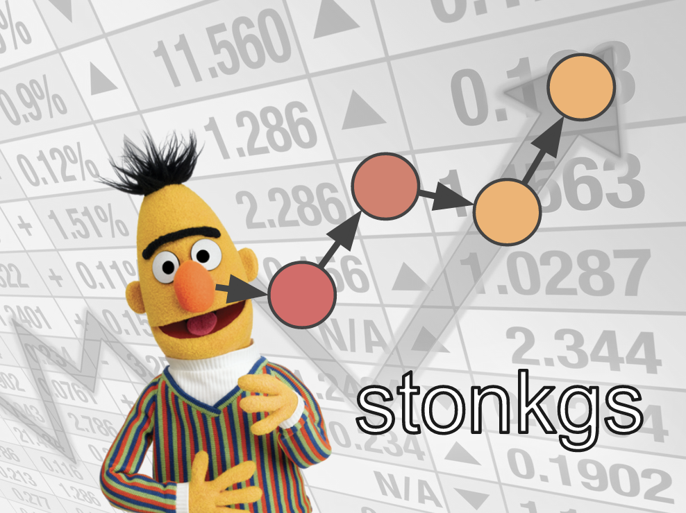

<p align="center">
  
</p>

<h1 align="center">
  STonKGs
</h1>

<p align="center">
    <a href="https://github.com/stonkgs/stonkgs/actions?query=workflow%3ATests">
        
    </a>
    <a href="https://pypi.org/project/stonkgs">
        
    </a>
    <a href="https://pypi.org/project/stonkgs">
        
    </a>
    <a href="https://github.com/stonkgs/stonkgs/blob/main/LICENSE">
        
    </a>
    <a href='https://stonkgs.readthedocs.io/en/latest/?badge=latest'>
        
    </a>
</p>

todo

## 💪 Getting Started

STonKGs is a Sophisticated Transformer that can be joinylu trained on biomedical text and Knowledge Graphs.
This multimodal Transformer combines structured information from KGs with unstructured text data to learn joint
representations. While we demonstrated STonKGs on a biomedical knowledge graph (i.e., [INDRA](https://github.com/sorgerlab/indra)), the model can be applied other domains. In the following sections we describe
the scripts that are necessary to be run to train the model on any given dataset.

### Training STonKGs

Once you have installed STonKGs as a Python package (see below), you can start training the STonKGs on your dataset
by running:

```bash
$ python3 -m stonkgs.models.stonkgs_pretraining
```

The configuration of the model can be easily modified by altering the parameters of the *pretrain_stonkgs* method.
The only required argument to be changed is *PRETRAINING_PREPROCESSED_POSITIVE_DF_PATH*, which should point to your
dataset. 

### Using the pre-trained model

TODO @Helena

## ⬇️ Installation

The most recent release can be installed from
[PyPI](https://pypi.org/project/stonkgs/) with:

```bash
$ pip install stonkgs
```

The most recent code and data can be installed directly from GitHub with:

```bash
$ pip install git+https://github.com/stonkgs/stonkgs.git
```

To install in development mode, use the following:

```bash
$ git clone git+https://github.com/stonkgs/stonkgs.git
$ cd stonkgs
$ pip install -e .
```

## Citation

Balabin H., Hoyt C.T., Birkenbihl C., Gyori B.M., Bachman J.A., Komdaullil A.T., Plöger P.G., Hofmann-Apitius M.,
Domingo-Fernández D. [STonKGs: A Sophisticated Transformer Trained on Biomedical Text and Knowledge Graphs
]() (2021), bioRxiv, TODO.

## ⚖️ License

The code in this package is licensed under the MIT License.

## 🛠️ Development

The final section of the README is for if you want to get involved by making a code contribution.

### ❓ Testing

After cloning the repository and installing `tox` with `pip install tox`, the unit tests in the `tests/` folder can be
run reproducibly with:

```shell
$ tox
```

Additionally, these tests are automatically re-run with each commit in a [GitHub Action](https://github.com/stonkgs/stonkgs/actions?query=workflow%3ATests).

### 📦 Making a Release

After installing the package in development mode and installing
`tox` with `pip install tox`, the commands for making a new release are contained within the `finish` environment
in `tox.ini`. Run the following from the shell:

```shell
$ tox -e finish
```

This script does the following:

1. Uses BumpVersion to switch the version number in the `setup.cfg` and
   `src/stonkgs/version.py` to not have the `-dev` suffix
2. Packages the code in both a tar archive and a wheel
3. Uploads to PyPI using `twine`. Be sure to have a `.pypirc` file configured to avoid the need for manual input at this
   step
4. Push to GitHub. You'll need to make a release going with the commit where the version was bumped.
5. Bump the version to the next patch. If you made big changes and want to bump the version by minor, you can
   use `tox -e bumpversion minor` after.

## 🍪 Cookiecutter Acknowledgement

This package was created with [@audreyr](https://github.com/audreyr)'s
[cookiecutter](https://github.com/cookiecutter/cookiecutter) package using [@cthoyt](https://github.com/cthoyt)'s
[cookiecutter-python-package](https://github.com/cthoyt/cookiecutter-python-package) template.
